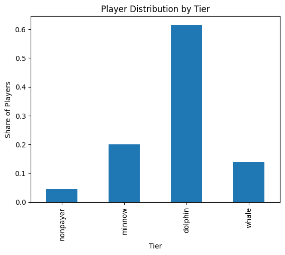
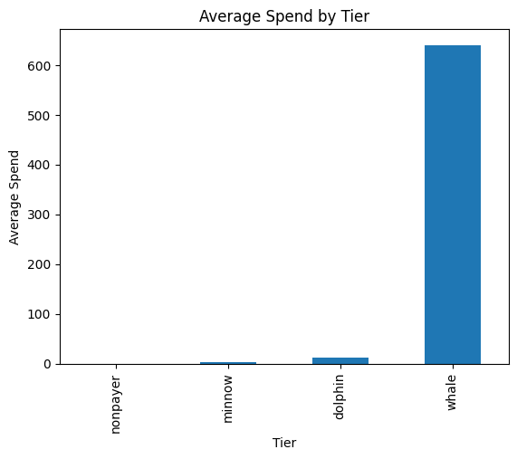
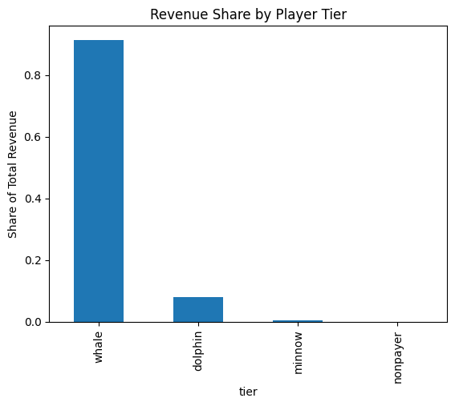
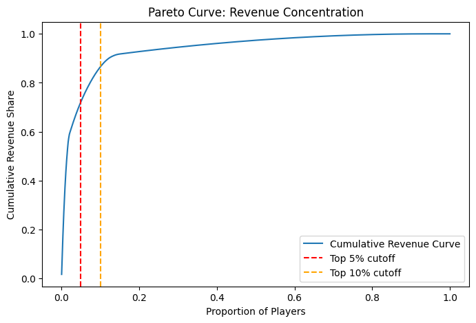
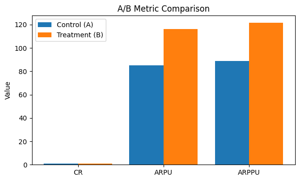
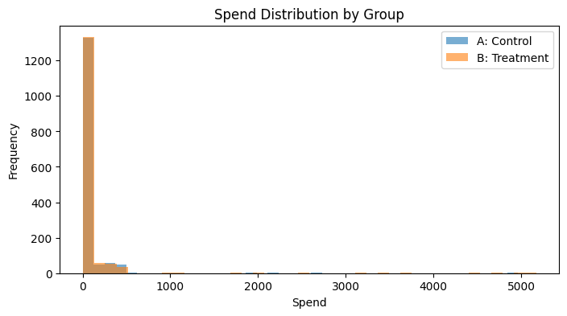
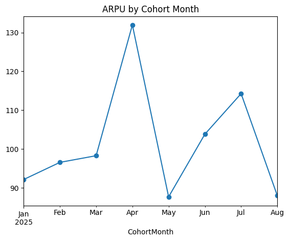
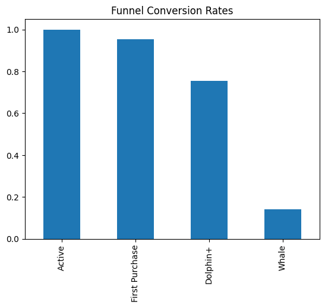
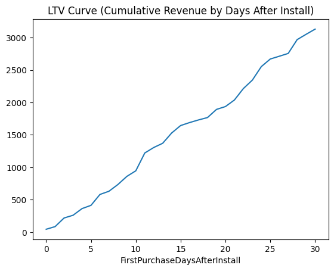

# 🎮 Mobile Game Monetization Analytics

This repository demonstrates an **end-to-end monetization analytics workflow** for a mobile free-to-play (F2P) game.
Using a synthetic dataset of **3,024 players**, we replicate common industry practices such as segmentation, KPI monitoring, revenue concentration, A/B testing, cohort analysis, funnel analysis, and LTV curve modeling.

The project mirrors real-world **Monetization Analytics** tasks (e.g., upgrade pacing, KPI dashboards, pricing experiments) and can be extended as a portfolio case study.

---

## 📂 Dataset Overview

* **Total records:** 3,024 players
* **Features:** demographics, gameplay behavior, in-app purchases
* **Key columns:**

  * `UserID`, `Age`, `Country`, `Device`, `GameGenre`
  * `SessionCount`, `AverageSessionLength`
  * `SpendingSegment` (categorical: minnow, dolphin, whale)
  * `InAppPurchaseAmount` (numeric spend)
  * `FirstPurchaseDaysAfterInstall`, `LastPurchaseDate`

---

## 📊 Analysis Framework

### **Step 2: Player Segmentation**

* Players segmented into **Nonpayer, Minnow, Dolphin, Whale** tiers.
* Findings:

  * **Dolphins** make up the majority of paying players.
  * **Whales** are a small fraction, but far outspend others.

  
  

---

### **Step 3: KPI Monitoring**

* **Metrics tracked:**

  * ARPU = 97.97
  * ARPPU = 102.62
  * Penetration Rate = 95.5% (⚠️ synthetic data, much higher than real-world F2P)
* Insight: paying penetration is unrealistic, but structure mirrors real dashboards.

---

### **Step 4: Revenue Concentration**

* **Whales = 91.4% of total revenue**
* **Top 5% of players = 72% of revenue**
* Strong **Pareto effect** observed.

  
  

---

### **Step 5: A/B Test Simulation**

* Simulated **bundle/pricing uplift**:

  * +5% spend uplift for payers
  * +5% conversion of nonpayers
* Results:

  * **ARPU/ARPPU significantly increased** (Welch’s t-test, p < 0.05)
  * Conversion rate stable
  * Treatment group shows **heavier tail of high-spending users**

  
  

---

### **Step 6: Cohort Analysis**

* Cohorts by **first purchase month**
* ARPU fluctuates by cohort, suggesting possible campaign/version effects

  

---

### **Step 7: Funnel Analysis**

* Simplified funnel:

  1. Active
  2. First Purchase
  3. Dolphin+
  4. Whale
* Conversion bottleneck: **Dolphin → Whale**

  

---

### **Step 8: LTV Curve**

* Cumulative revenue by **days after install**
* Shows steady growth in first 30 days, indicating prolonged monetization

  

---

## 💡 Business Insights

* **Revenue is highly concentrated**: whales contribute >90% of revenue.
* **Bundle/pricing tests** can significantly raise ARPU/ARPPU.
* **Cohort analysis** highlights differences in player quality across months.
* **Funnel analysis** shows main leakage between mid-tier and whales.
* **LTV curve** supports UA ROI evaluation (LTV vs CAC).

---

## 🚀 Extensions

* Demographic/device segmentation (Country, iOS vs Android, PaymentMethod)
* Long-term retention modeling (D30/D90)
* Predictive modeling for **churn risk** and **whale detection**

---

## 📌 Conclusion

This project demonstrates how to build a **Monetization Analytics Pipeline** that mirrors industry practice:

* Segmentation → KPI → Concentration → A/B Test → Cohort → Funnel → LTV

It bridges raw data into **actionable insights** that support product, UA, and monetization teams.

---
